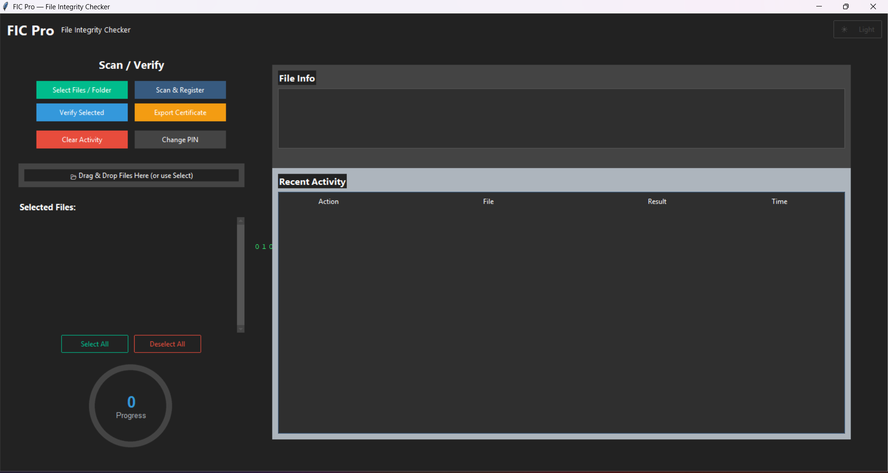

# File Integrity Checker (FIC Pro)


A cybersecurity tool that checks for file tampering, corruption, or unauthorized modification using secure hashing and digital signatures.

---

## Why use it?

- Detects unwanted changes in files
- Alerts if data gets corrupted
- Helps ensure files remain original and trustworthy
- Easy to use with a modern UI

---

## Who Can Use This?

- Students learning cybersecurity fundamentals
- Developers protecting sensitive project files
- Blue-team / IT security professionals
- Anyone concerned about file integrity and tampering

---

## How to Run

1. Install **Python 3.11** or above.
2. Open the project folder in a terminal.
3. Install necessary dependencies:
    ```bash
    pip install -r requirements.txt
    ```
4. Start the application:
    ```bash
    python gui_fic.py
    ```

The GUI will launch. You can:
- Select and register files
- Verify file integrity anytime
- Export PDF certificates for evidence

---

## Full Feature List (FIC Pro)

### GUI & User Experience
- Modern interface using ttkbootstrap (Dark/Light themes)
- Theme toggle button (Darkly ↔ Flatly)
- Full-screen, resizable window
- Left: actions + file selection
- Right: file details + activity log
- Matrix-style animated background (thread-based)
- Scrollable file list + checkboxes
- Live status messages & heartbeat progress meter
- Optional sound feedback (OS fallback)

---

### File Input & Loading
- Select multiple files or folders
- Recursive scan for folder imports
- Drag & drop support (tkinterdnd2)
- Prevents duplicate files
- Select all / Deselect all
- Clear selection anytime

---

### PIN Security System
- Secure salted SHA-256 PIN storage
- Default PIN: 1234 (change recommended)
- PIN required for protected actions
- Safe PIN update workflow

---

### File Integrity Operations

#### 1. Scan / Register File
- Generates SHA-256 hash
- Saves encrypted integrity record
- Displays hash and file info
- Timeline logging with timestamp

#### 2. Verify File
Compares stored vs current hash:
- Safe — unchanged
- Modified — tampered/corrupted
- Not Registered — no record exists

---

### History & Logging
- Persistent `history.json`
- All events recorded with timestamps
- Click log entry → view details
- Clear Activity (PIN protected)

---

### Integrity Certificate (PDF Export)
- Generate secure certificate for any file
- Stylish ReportLab design:
  - Gradient background
  - Rounded frame
  - File information
  - Hash comparison
  - Integrity status: MATCH / MISMATCH
  - Timestamp + signature placeholder

---

### Storage & Helpers
- `sha256_hash()`, `save_record()`, `load_records()`, `append_history()`
- Auto-create runtime files using `ensure_files()`
- Uses:
  - `history.json` — logs
  - `records.json` — verified hashes
  - `pin.json` — encrypted PIN

---

### Visual & UX Enhancements
- Matrix animation background
- Pulsing heartbeat indicator
- Drag area glow effect
- User-friendly dialogs for actions

---

## Screenshots

### Main Interface



---

## Keywords

Cybersecurity, File Integrity Checker, Hash Verification, Digital Signature, Tamper Detection, Python Security Tool, InfoSec, Malware Defense


